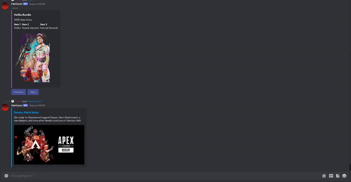

# Summary

This discord bot provides ease of access to data commonly utilized by Apex Legends users. If you want to check up on Apex in-game information **WITHOUT** launching the game, adding this bot to your server is a better alternative if you always leave your discord open. Otherwise you can stick to web searches or opening the game as that will fulfill the same purpose.

# Bot Invitation
Will be available for server invite on top.gg once enough features have been added.

# Command List

## User Commands

By default all user commands are prefixed with the `/` character.  

e.g. To use the bot's map command, enter `/map`. Below is a visual of the command's usage.

| Command    | Options/Subcommands    | Description       |
|------------|------------------------|-------------------|
| craft      | daily,weekly           | Get daily and weekly crafting rotations from the replicator |
| create     | role,title,team-size   | Creates a matchmaking lobby. Click join or leave to queue or dequeue. When the queue is fulfilled or the role option is used                                             players will receive notifications. |
| heirloom   | setup,edit,count       | Track your total Apex packs collected from past events |
| help       |                        | Brings up documentation, support, and report sections
| map        | ranked,unranked        | View the current and next map along with their durations and start times |
| latest     | patch,collection-event | Returns the latest patch notes and collection events as clickable links |
| status     |                        | Checks server status |
| store      |                        | Get current in game shop bundles along with pricings. Displays both Apex Coins and Legend Tokens if available |

# API

This bot makes use of [Apex Legends Status](https://apexlegendsapi.com/#introduction), a public third party API.
As mentioned on their website, store data may not always be accurate/up to date as the project is still in beta.     
